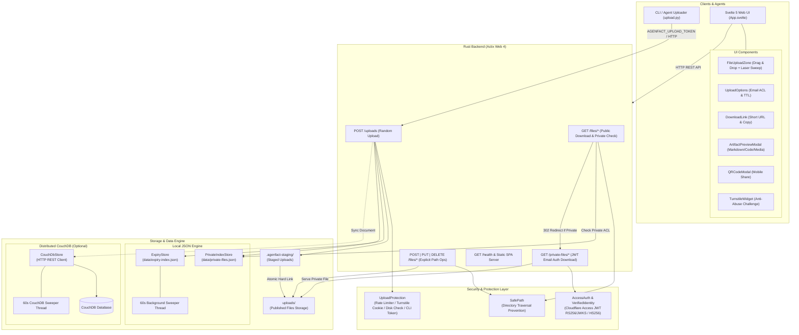

# Agenfact

**Agenfact** (`Agent` + `Factum`) is a lightweight, stateless digital artifact hosting and delivery platform built specifically for **AI Agents** (and developers) to easily output, host, and share their generated artifacts (HTML pages, Markdown reports, code snippets, UI mockups, and files) with built-in access control, CouchDB persistence option, and anti-abuse protection.

---

### 🧬 Name Origin & Concept

* **Name**: **Agenfact** `/ˈeɪ.dʒən.fækt/` (Agent Artifact / Cyber Entity Hub)
* **Etymology**: 
  * **`Agent`** — Autonomous AI Agents / Silicon Lifeforms.
  * **`Factum`** — Latin for *"a thing done or made"* (the etymological root of *Artifact*).
* **Concept**: In modern AI workflows, agents produce complex digital artifacts. Agenfact acts as a high-speed, stateless uplink core where agents deposit their creations for instant rendering, secure email-based JWT access authorization, automatic TTL lifecycle expiration, and CouchDB distributed persistence.

---

- [Features](#features)
- [Architecture](#architecture)
- [Usage](#usage)
- [Configuration](#configuration)
- [API](#api)
  - [`POST /uploads`](#post-uploads)
  - [`GET /files/:path`](#get-filespath)
  - [`GET /private-files/:path`](#get-private-filespath)
  - [`POST /files/:path`](#post-filespath)
  - [`PUT /files/:path`](#put-filespath)
  - [`DELETE /files/:path`](#delete-filespath)
- [Development](#development)
- [CI/CD](#cicd)

## Features

- **Random filename generation**: `/uploads` generates unique 8-character filenames.
- **Custom file paths**: `/files/:path` supports explicit create/update/delete.
- **Path normalization**: file paths are normalized to prevent directory traversal attacks.
- **Local JSON index & CouchDB backend**: supports local JSON indices (`data/`) or CouchDB distributed storage (`couchdb_url`).
- **File lifecycle & expiry sweeper**: expiration is tracked with in-process and CouchDB background sweepers.
- **Private file redirect flow**: private-index matches on `/files/:path` redirect to `/private-files/:path`.
- **Cloudflare Access verification**: `/private-files/:path` verifies `Cf-Access-Jwt-Assertion` or standard `Authorization: Bearer ***` JWT (RS256/JWKS with 1hr cache, or HS256 for local testing).
- **Cyber Dark Web UI**: Svelte 5 + Vite + TypeScript + Tailwind CSS 4 upload UI with drag & drop, laser sweep animation, artifact preview modal (Markdown/Code/Media), short URL generation, and QR code sharing.

## Architecture



### Tech Stack

| Layer | Technology | Key Components |
|-------|-----------|----------------|
| Backend | Rust 2024 edition, Actix Web 4 | `main.rs`, `config.rs`, `path.rs` (`SafePath`) |
| Auth & Security | Cloudflare Access JWT, Turnstile, Token Auth | `auth.rs` (RS256/JWKS & HS256), `upload_protection.rs` |
| Frontend | Svelte 5, Vite, TypeScript, Tailwind CSS 4 | `App.svelte`, `FileUploadZone`, `ArtifactPreviewModal` |
| Local Storage | Local filesystem & JSON indices | `uploads/`, `data/expiry-index.json`, `data/private-files.json` |
| Cloud Storage | CouchDB distributed backend (Optional) | `couchdb.rs`, `docker-compose.yml`, `migrate_to_couchdb.py` |
| Agent Skill | Python 3 + requests + ua-generator | `skills/agenfact/scripts/upload.py`, `compress.py` |
| CI/CD | Gitea Actions & Docker | `.gitea/workflows/`, `Dockerfile`, `docker-compose.yml` |

## Usage

### Prerequisites

- [Docker & Docker Compose](https://docs.docker.com/get-docker/) (Recommended) OR
- [Rust and Cargo](https://rustup.rs/) (2024 edition) & [Node.js](https://nodejs.org/) 20+ / [pnpm](https://pnpm.io/)

### Running with Docker Compose (Recommended)

Run Agenfact alongside CouchDB in one command:

```bash
docker compose up --build
```

- Web App: [http://localhost:8080](http://localhost:8080)
- CouchDB Admin: [http://localhost:5984](http://localhost:5984)

### Running Locally (Cargo)

**Linux/macOS:**

```bash
RUST_LOG=info cargo run
```

**Windows (PowerShell):**

```powershell
$env:RUST_LOG="info"; cargo run
```

With custom bind settings:

```bash
RUST_LOG=info AGENFACT_ADDRESS=0.0.0.0 AGENFACT_PORT=8080 cargo run
```

## Configuration

Configured with `Agenfact.toml` and/or environment variables (`AGENFACT_*`).

### Core Settings

| Key            | Environment Variable | Default      | Description                            |
| -------------- | -------------------- | ------------ | -------------------------------------- |
| `address`      | `AGENFACT_ADDRESS`      | `127.0.0.1`  | HTTP bind address                      |
| `port`         | `AGENFACT_PORT`         | `8000`       | HTTP bind port                         |
| `web_path`     | `AGENFACT_WEB_PATH`     | `./web/dist` | Path to static web assets              |
| `uploads_path` | `AGENFACT_UPLOADS_PATH` | `./uploads`  | Upload storage path                    |
| `data_path`    | `AGENFACT_DATA_PATH`    | `./data`     | Persistent metadata (index/state) path |
| `default_upload_ttl_secs` | `AGENFACT_DEFAULT_UPLOAD_TTL_SECS` | `604800` | Positive default upload TTL when `expire` is omitted |
| `max_upload_ttl_secs` | `AGENFACT_MAX_UPLOAD_TTL_SECS` | `604800` | Positive maximum accepted upload TTL |

### CouchDB Settings (Optional)

| Key | Environment Variable | Default | Description |
| --- | -------------------- | ------- | ----------- |
| `couchdb_url` | `AGENFACT_COUCHDB_URL` | _(unset)_ | Base URL of CouchDB instance (e.g. `http://localhost:5984`) |
| `couchdb_db` | `AGENFACT_COUCHDB_DB` | `agenfact` | Target CouchDB database name |
| `couchdb_user` | `AGENFACT_COUCHDB_USER` | _(unset)_ | CouchDB Basic auth username |
| `couchdb_password` | `AGENFACT_COUCHDB_PASSWORD` | _(unset)_ | CouchDB Basic auth password |

### Private access (Cloudflare Access)

| Environment Variable           | Default                                | Description                                        |
| ------------------------------ | -------------------------------------- | -------------------------------------------------- |
| `AGENFACT_CF_ACCESS_ISSUER`       | `https://example.cloudflareaccess.com` | Expected JWT issuer                                |
| `AGENFACT_CF_ACCESS_AUD`          | _(empty)_                              | Expected audience (required for production)        |
| `AGENFACT_CF_ACCESS_JWKS_URL`     | `${ISSUER}/cdn-cgi/access/certs`       | JWK Set URL for signature verification             |
| `AGENFACT_CF_ACCESS_HS256_SECRET` | _(unset)_                              | Optional HS256 verifier secret (for local testing) |

### Upload Protection (Rate Limiting & Challenge)

| Environment Variable               | Default | Description                                                                                          |
| ---------------------------------- | ------- | ---------------------------------------------------------------------------------------------------- |
| `AGENFACT_UPLOAD_RATE_SOFT_LIMIT`     | `5`     | Requests per window before Turnstile challenge is required                                           |
| `AGENFACT_UPLOAD_RATE_HARD_LIMIT`     | `20`    | Hard rate limit (requests per window), accepted range `0..=100`                                      |
| `AGENFACT_UPLOAD_RATE_WINDOW_SECS`    | `60`    | Time window in seconds for rate counting                                                             |
| `AGENFACT_TURNSTILE_PASS_TTL_SECS`  | `600`   | Duration (seconds) of the HttpOnly upload-pass cookie                                                |
| `AGENFACT_MIN_FREE_DISK_BYTES`      | `1073741824` | Minimum free disk space (1 GiB by default) required to accept uploads                             |
| `AGENFACT_TRUST_CF_CONNECTING_IP`   | `false` | Trust `CF-Connecting-IP` header for client IP                                                        |
| `AGENFACT_UPLOAD_TOKEN`             | _(unset)_ | Bearer token for CLI/automated uploads. Bypasses Turnstile challenge                                |
| `AGENFACT_TURNSTILE_SITE_KEY`       | _(unset)_ | Cloudflare Turnstile site key for frontend challenge widget                                          |
| `AGENFACT_TURNSTILE_SECRET`         | _(unset)_ | Cloudflare Turnstile secret key for server-side verification                                         |
| `AGENFACT_TURNSTILE_HOSTNAME`       | _(unset)_ | Expected hostname in Turnstile response                                                              |
| `AGENFACT_TURNSTILE_SITEVERIFY_URL` | `https://challenges.cloudflare.com/turnstile/v0/siteverify` | Turnstile siteverify API endpoint |
| `AGENFACT_MAX_CONCURRENT_UPLOADS`   | `4`     | Maximum number of concurrent uploads allowed system-wide                                               |

### Local Development / Testing (HS256)

When `AGENFACT_CF_ACCESS_HS256_SECRET` is set, Agenfact will use this secret to verify JWTs instead of fetching JWKS from Cloudflare.

**Example Configuration (.env):**

```bash
AGENFACT_CF_ACCESS_ISSUER=https://issuer.example.com
AGENFACT_CF_ACCESS_AUD=agenfact-app
AGENFACT_CF_ACCESS_HS256_SECRET=my-local-secret
```

**Testing with curl:**

1.  **Upload a private file** for a specific user:

```bash
curl -X POST \
  -F "file=@secret.txt" \
  -F "authorized_emails=tester@example.com" \
  "http://localhost:8000/uploads" -i
```

2.  **Access the file** using a generated HS256 token:

```bash
curl -H "Cf-Access-Jwt-Assertion: <your-jwt-token>" \
  "http://localhost:8000/private-files/<generated-id>.txt" -i
```

## API

### `POST /uploads`

Upload a file with generated ID-based filename.

- Content-Type: `multipart/form-data`
- Query parameters:

| Name     | Required | Type         | Description                    | Default |
| -------- | :------: | ------------ | ------------------------------ | ------- |
| `expire` |    ❌    | Query string | TTL (`10s`, `5m`, `24h`, `7d`) | `168h`  |

- Form-data fields:

| Name                | Required | Type   | Description                                                                                                                 |
| ------------------- | :------: | ------ | --------------------------------------------------------------------------------------------------------------------------- |
| `file`              |    ✅    | File   | File payload                                                                                                                |
| `authorized_emails` |    ❌    | String | Comma-separated list of emails allowed to access this file. Presence of this field automatically marks the file as private. |

Response:

- `201 Created`
- `Location` header: `/files/<generated-name>`
- JSON body: `{ "message": "file uploaded successfully", "expires_at": <unix-seconds> }`

**Example (Public):**

```bash
curl -X POST -F "file=@sample.txt;type=text/plain" \
  "http://localhost:8000/uploads?expire=1h" -i
```

**Example (Private):**

```bash
curl -X POST \
  --form 'file=@secret.pdf;type=application/pdf' \
  -F "authorized_emails=bob@example.com,alice@example.com" \
  "http://localhost:8000/uploads" -i
```

### `GET /files/:path`

Download file content from uploads path.

- `200 OK` on success
- `302 Found` to `/private-files/:path` if file is marked private
- `404 Not Found` if missing

### `GET /private-files/:path`

Read private file content.

- Requires request header: `Cf-Access-Jwt-Assertion` or `Authorization: Bearer <jwt-token>`
- Validates JWT signature/issuer/audience/expiry
- Checks per-file email authorization list

Response:

- `200 OK` when authorized
- `401 Unauthorized` on missing/invalid token
- `403 Forbidden` on valid token but email not in file's authorized list

### `POST /files/:path`

Create file at explicit path (`201 Created`, `409 Conflict` if exists).

### `PUT /files/:path`

Create or overwrite file at explicit path (`201 Created` if new, `200 OK` if overwritten).

### `DELETE /files/:path`

Delete file at explicit path (`200 OK` on success, `404 Not Found` if missing).

## Development

### Backend

```bash
# Run with debug logging
RUST_LOG=debug cargo run

# Run tests
cargo test
```

### Frontend

```bash
cd web

# Install dependencies
pnpm install

# Dev server with hot reload
pnpm dev

# Production build
pnpm run build

# Unit test & check
pnpm test
pnpm run check
```

### One-Time CouchDB Migration

To migrate local storage and JSON indices into CouchDB:

```bash
python3 scripts/migrate_to_couchdb.py --couchdb-url http://localhost:5984 --couchdb-db agenfact
```

### Project Structure

```
agenfact/
├── src/                    # Rust backend source
│   ├── main.rs            # Application entry point, route mounting
│   ├── config.rs          # Figment-based configuration (TOML + env)
│   ├── auth.rs            # Cloudflare Access JWT validation (RS256/HS256)
│   ├── files.rs           # File CRUD operations, path validation
│   ├── uploads.rs         # Random filename generation, multipart uploads
│   ├── expiry.rs          # Background sweeper for file expiration
│   ├── private_index.rs   # Private file metadata (authorized emails)
│   ├── couchdb.rs         # CouchDB persistence & sweeper
│   └── upload_protection.rs # Turnstile challenge & rate limiter
├── web/                   # Svelte frontend
│   ├── src/
│   │   ├── App.svelte     # Main upload UI
│   │   └── components/    # UI components
│   ├── package.json
│   ├── svelte.config.js
│   └── vite.config.ts
├── scripts/               # Helper & migration scripts
│   └── migrate_to_couchdb.py # One-time CouchDB migration script
├── skills/                # Agent Skills
│   └── agenfact/          # Agenfact skill for AI agents
├── docker-compose.yml     # Docker Compose for app + CouchDB
├── Dockerfile             # Multi-stage build (Node/pnpm + Rust)
└── Cargo.toml             # Dependencies & package metadata
```

## CI/CD

Uses Gitea Actions for automated workflows:

| Workflow | Trigger | Description |
|----------|---------|-------------|
| `rust.yml` | Push/PR to `main`, tags `*.*.*` | Build, test, Trivy vulnerability scan |
| `docker.yml` | Push/PR to `main`, tags `*.*.*` | Docker build, Trivy image scan, push to registry |

Registry: `registry-gitea.home-infra.weii.cloud/home-infra/agenfact`
